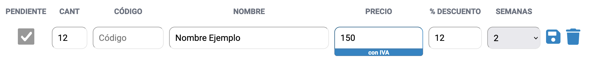
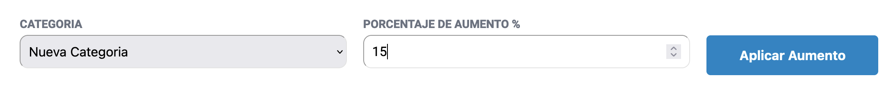

# TusListas

TusListas tiene como objetivo principal organizar el inventario de tu comercio o empresa, permitiéndote clasificar los artículos de manera eficiente a través de una Agenda y un Buscador. Además, ofrece la posibilidad de mantener actualizadas las listas de precios a través del registro de Ingreso de Mercancía y la administración de Aumentos Generales. Esta plataforma te facilitará la gestión de productos y precios, contribuyendo a un flujo de trabajo más ordenado y efectivo para tu negocio.

## Enumeración de Funcionalidades/Secciones:

* Buscador
* Ingreso de Mercadería - Descuentos y Duración
* Agregar un Nuevo Producto - Ganancia - Fraccionado - Cálculo del Precio de Venta
* Aumentos Generales - Aumento Basado en el Dólar - Registro de Aumentos
* Agenda
* Herramientas para el Propietario y Roles de Usuario - Agregar y Eliminar Miembros de la Empresa - Cambiar el Nombre de la Empresa - Estadísticas
* Responsive: Compatible con Todos tus Dispositivos

## Buscador:

El buscador te permite listar todos los productos, filtrarlos y ordenarlos para facilitar la búsqueda. También puedes buscar por nombre o por código; este código único se genera automáticamente al crear el producto.

## Ingreso de Mercadería:

El Ingreso de Mercadería se basa en como se presentan las facturas, remitos o boletas de un distribuidor o proveedor. Aquí puedes registrar la mercadería ingresada, evitando duplicados mediante dos buscadores: uno por códigos de productos y otro por nombre. Esta sección te permite verificar que los precios sigan vigentes y actualizar la fecha. El precio puede ser ingresado con o sin IVA presionando en el botón que se encuentra debajo del campo "precio". Si el producto ya existe, este campo se completa automáticamente con el precio de costo sin IVA. También puedes aplicar descuentos temporales y establecer su duración.

#### Ingreso de productos existentes

Es útil ingresar cada pedido en esta vista, ya que permite comprobar que el precio siga vigente y, al mismo tiempo, actualiza la fecha del mismo. De esta forma, el usuario puede saber cuándo fue la última vez que pagó ese precio por el producto.

#### Descuentos temporales

Los Descuentos Temporales se crean cuando se ingresa un producto. El campo "Descuento" toma como valor un número que corresponde al porcentaje de descuento (por ejemplo, 40 representa un 40% de descuento). También se debe indicar la duración de este descuento, expresada en semanas. Este descuento será eliminado al cumplirse la duración. Para crear o extender un descuento, solo se debe ingresar el producto en esta sección.

#### Pendientes

Para mantener el flujo de trabajo al ingresar mercadería, el usuario puede indicar que un producto es "Pendiente" si este no se encuentra en el catálogo almacenado. De otra forma, el usuario tendría que salir de esta sección y dirigirse a "Nuevo Producto" para luego regresar a Ingreso de Mercadería. Marcando el producto como "Pendiente", TusListas permite almacenar temporalmente los datos (cantidad, nombre, precio de costo con/sin IVA, descuento y duración). Los "Pendientes" no son ingresados al catálogo de productos ni pueden ser buscados en el buscador. Se encuentran disponibles en la sección "Nuevo Producto" y pueden ser agregados uno por uno en el catálogo (esto es indispensable para poder asignarles una categoría, proveedor, fabricante, dólar y ganancia). Además, el usuario tiene la posibilidad de crear una versión fraccionada de este artículo.

## Nuevo Producto:

En esta sección, puedes ingresar nuevos productos completando el formulario. El código es único y se genera automáticamente con cada nuevo producto. Además, puedes darle un nombre, asignar categorías, proveedores y fabricantes para clasificarlo y buscarlo en el futuro. Tienes la opción de ingresar la cotización actual del dólar en cada producto. Por defecto, este campo se completa con el dólar más alto entre tus productos almacenados.

#### Precio con IVA

El IVA aplicado a los precios es del 21%. Si ingresas el valor sin IVA, se suma este 21%, y viceversa si ingresas el valor con IVA. Luego, se aplica la ganancia indicada para calcular el Precio de Venta.

#### Ganancia:

La ganancia es un porcentaje que se suma al precio de costo, representando tus beneficios. Puedes asignar la ganancia aplicada a la categoría asignada, al proveedor o definir una ganancia personalizada.

Esta ganancia será multiplicada por el Precio de Costo para calcular el Precio de Venta y se expresa como un número decimal, donde 1.2 es igual al 20%. Por ejemplo:

| ganancia | precio de costo | resultado |
| -------- | --------------- | --------- |
| 1.2      | 100             | 120       |

Hay 3 opciones para asignar una ganancia al producto:

- Categoría: el producto tomará la ganancia aplicada a esta categoría.
- Proveedor: el producto tomará la ganancia aplicada a este proveedor.
- Personalizada: un índice personalizado para este producto. La desventaja de esta opción es que si deseas cambiar el índice de ganancia posteriormente, debes hacerlo dentro de cada producto.

#### Precio de Venta

El Precio de Venta se calcula a partir del precio de costo (con o sin IVA) y se multiplica por la ganancia ingresada por el usuario. Por ejemplo:

| Costo sin IVA | IVA  | Ganancia | Precio de Venta |
| ------------- | ---- | -------- | --------------- |
| 100           | 1.21 | 1.8      | 217.8           |

Para evitar conflictos de centavos, los precios de venta se redondean siempre hacia arriba en un número múltiplo de 10. Hay que tener esto en cuenta al momento de comparar los precios de TusListas con los calculados a mano. Este redondeo también se aplica a los descuentos.

#### Fraccionado:

El fraccionado te permite crear una versión "fraccionada" de un producto original, compartiendo la mayoría de las características, pero con su propio código único y una ganancia adicional. Esto es útil para productos que se venden tanto como unidades individuales como fracciones.

Un producto fraccionado comparte nombre (añadiendo "- FRACCIONADO" para diferenciarlo), Categoría, Proveedor, Fabricante, Cotización Dólar, Precio Costo y Ganancia. Si se modifica cualquiera de estas cualidades del producto original, también serán modificadas en el fraccionado. Si el producto original es eliminado, también se elimina su versión fraccionada.

Un producto fraccionado cuenta con cualidades propias:

- Unidad del Producto, este es el nombre que se le da a la unidad. Es simplemente el nombre que se usa para referirse a la fracción cuando se busca el producto.
- Total de Unidades, el número por el cual se divide el producto original. Si el producto original tiene un Precio de Costo de 500 y el Total de Unidades es de 2, el precio de costo fraccionado sería 250.
- Ganancia Extra Fracción, esta ganancia se suma al Precio de Venta calculado para el producto original. Se expresa en decimales y se multiplica por el Precio de Venta del producto completo. Si no deseas añadir esta ganancia extra a la versión fraccionada, puedes utilizar 1.

| Precio Venta | Total Unidades | Ganancia Extra Fracción | Resultado |
| ------------ | -------------- | ------------------------ | --------- |
| 150          | 2              | 1.1                      | 82.5      |

## Aumentos Generales:

Esta es una poderosa herramienta a la hora de aumentar un lote completo de productos. Es una de las principales razones por las que los productos se clasifican según su categoría, proveedor y fabricante. Esta funcionalidad solo está disponible para el usuario Owner (el creador de la empresa o comercio), ya que estos aumentos no pueden revertirse.

En este ejemplo, se aplica un aumento del 15% a todos los productos que pertenezcan a la categoría "Nueva Categoría". Esto es útil para realizar aumentos lineales, pero no puede revertirse. Siempre es más aconsejable hacer los aumentos mediante el Ingreso de Mercadería o modificando cada producto individualmente.

Dentro de la sección "Registro de Aumentos" se almacena un registro de cada uno de estos Aumentos Generales (los últimos 50 registros). La fecha de todos los precios modificados de esta forma también será actualizada.

#### Aumento en Base al Dólar:

Otra herramienta que te permite ajustar los precios según las tasas de cambio. La cotización del dólar se aplica a todos los productos, actualizando los precios de los productos existentes.

Este es el motivo por el cual se asigna un elemento que corresponde a la cotización del dólar en cada uno de los productos. Si utilizas correctamente este elemento, cada producto tiene asignada la cotización del dólar en el día que fue ingresado.

Al ingresar la cotización actual del dólar se realiza una búsqueda de todos los productos cuya cotización sea inferior a la ingresada. Todos los productos encontrados son listados en esta sección y el usuario tiene la posibilidad de actualizarlos. Esta actualización cambia el valor de cotización del dólar de cada uno de los productos listados y aumenta su precio de costo acorde a la diferencia entre el valor desactualizado y el actual.

Al igual que otros Aumentos Generales, los aumentos en base al dólar son registrados en el Registro de Aumentos y tampoco pueden revertirse. Se debe tener precaución con esta herramienta, ya que afecta a un lote completo de productos y puede comprometer el precio de los mismos. La fecha de todos los productos es actualizada al día del aumento. Esta herramienta solo puede ser utilizada por un usuario con el rol de Owner (el creador de la empresa/comercio).

#### Registro de Aumentos:

Aquí se registran los cambios realizados a través de las herramientas de Aumentos Generales, proporcionando un historial de modificaciones.

## Agenda:

La agenda te ayuda a administrar las categorías, proveedores y fabricantes de tus productos. Cada uno de ellos tiene un propósito específico, desde clasificar productos hasta aplicar ganancias y aumentos generales.

- Categoría: Es una forma de clasificar los artículos que comercializas. Esto es muy importante a la hora de buscar productos (listado de Todos los Productos). También para definir una ganancia en múltiples productos diferentes y permite aplicar Aumentos Generales a todo un lote de artículos. La ganancia puede ser modificada en cualquier momento y sin riesgo. Todos los productos pertenecientes a la categoría cambiarán su Precio de Venta pero no su Precio de Costo (puede experimentar con índices de ganancia diferentes sin perder la referencia del precio real de tus productos). Si no deseas utilizar este tipo de clasificación, simplemente puedes crear una categoría con un nombre genérico como "Otros" y aplicar una ganancia de 1 (sin ganancia). De esta forma, la categoría no afecta al producto pero también pierde las funcionalidades de clasificación y Aumentos Generales.
- Proveedor: Es otra forma de clasificar artículos. Los proveedores son las distribuidoras o fábricas que abastecen al comercio/empresa del usuario. En cada uno, el usuario puede ingresar los datos de contacto para disponer de ellos en cualquier momento. También puede aplicar un índice de ganancia que funciona exactamente igual que el de la Categoría.
- Fabricante: Es otra forma de clasificar artículos y permite al usuario almacenar los datos de contacto de los fabricantes de sus productos para disponer de ellos en cualquier momento. También es muy útil a la hora de utilizar los Aumentos Generales. En caso de que un fabricante provea la mercadería, es conveniente crear tanto un Proveedor como un Fabricante, aunque compartan la mayoría de los datos. Luego, es indistinto cuál se utiliza para el Aumento General de los artículos que provee.

## Herramientas del Propietario:

Al momento de crear una nueva empresa/comercio, también estás creando una cuenta con el rol de administrador, que es el dueño de la empresa. Un administrador tiene acceso a herramientas que le permiten invitar a otros usuarios, cambiar el nombre de la empresa, eliminar miembros, acceder a estadísticas y realizar Aumentos Generales.

Solo los usuarios con el rol de Administrador tienen a disposición el enlace "Admin" donde encuentran las herramientas de administración. La funcionalidad de Aumentos Generales está bloqueada para todos los usuarios que no sean administradores. Es muy importante el rol de este usuario, ya que puede realizar cambios que comprometen la integridad de los datos de su empresa, como modificar el precio de costo de todos sus productos en Aumentos Generales, eliminar usuarios o cambiar el nombre de la empresa.

#### Invitar Usuario

Una vez verificada la cuenta del usuario administrador, puedes acceder a las herramientas de administrador y completar el campo "Invitar Usuario". De esta forma, TusListas envía un correo electrónico a la dirección ingresada con una invitación a la aplicación y la empresa. El usuario invitado recibe un enlace que le permite crear una cuenta relacionada únicamente con tu empresa. Este nuevo usuario puede acceder a todas las herramientas de TusListas, excepto las antes mencionadas. También puede ver y modificar todos los productos.

#### Listar y eliminar usuarios

El administrador cuenta con un listado de los usuarios que pertenecen a su empresa y puede eliminar a cualquiera de ellos.

#### Estadísticas

Funcionalidad en desarrollo. Llegará pronto!

#### Cambiar nombre de la empresa

El usuario administrador puede cambiar el nombre de la empresa en cualquier momento, el resto de los usuarios solo visualiza este cambio después de haber cerrado sesión una vez.

#### En todos tus dispositivos

TusListas funciona en dispositivos móviles sin necesidad de "descargar una aplicación" y se ejecuta dentro de cualquier navegador que tengas instalado. Esto es muy útil para que utilices el buscador y consultes cualquier producto en cualquier momento, pero dificulta utilizar herramientas como el Ingreso de Mercadería o visualizar tablas completas. La versión de escritorio de TusListas es mucho más cómoda a la hora de utilizar estas herramientas y es la más aconsejable.
